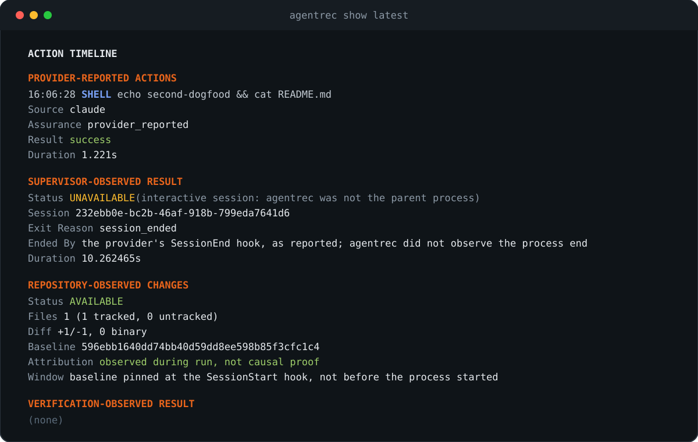

<p align="center">
  
</p>

<table align="center">
  <tr>
    <td width="50%" align="center">
      <br>
      <sub><b>1 回の実行を、読み返す。</b><br>エージェントが言ったこと、プロセスがしたこと、リポジトリが示すこと、チェックが返したことを、混ぜずに並べます。</sub>
    </td>
    <td width="50%" align="center">
      <br>
      <sub><b>4 つの観測者、4 つの帰属。</b><br>何もスコアに合算せず、得られなかった証拠を合格として扱うこともありません。</sub>
    </td>
  </tr>
</table>

# agentrec

<div align="center">

[English](README.md) | [한국어](README.ko.md) | 日本語 | [简体中文](README.zh-CN.md)

[](https://github.com/seongwoo-choi/agentrec/actions/workflows/ci.yml)
[](https://github.com/seongwoo-choi/agentrec/releases)
[](https://go.dev/dl/)
[](LICENSE)
[](https://github.com/seongwoo-choi/agentrec)

</div>

<p align="center">
  <strong>コーディングエージェントの実行ごとに、ターミナルが消えた後も読み返せる、帰属情報付きのローカル証拠バンドルが残ります。</strong><br>
  <em>agentrec が起動した実行でも、対話セッションから記録した実行でも同じです。プロバイダーの主張、プロセス結果、リポジトリ差分、固定されたチェック — それぞれ別の観測者に由来し、決して 1 つのスコアには合算されません。</em>
</p>

**agentrec** は、Claude Code または Codex の 1 回の実行をバンドルとして記録します。
正規化されたアクションのタイムライン、監督対象プロセスの結果、実行ウィンドウを
またいだリポジトリの差分、そしてリポジトリ自身が固定したチェックの結果です。
それぞれ異なる観測者に由来し、バンドルはそれらを分けたまま保持します。だからこそ、
コードレビュー、障害調査、引き継ぎ、新しいエージェントバージョンを信頼するかの判断を、
要約ではなく観測された事実から始められます。

[リリースノート](docs/releases/v0.3.0.md) ·
[設計ノート](docs/plans/2026-07-27-agentrec-flight-recorder.md) ·
[Shadow runner の設計](docs/plans/2026-07-29-shadow-runner.md) ·
[Dogfood の証拠](docs/dogfood/2026-07-28-evidence.md) ·
[サードパーティ通知](THIRD_PARTY_NOTICES.md)

> [!NOTE]
> agentrec は、エージェントをリアルタイムで操作する frontend でも、クラウドテレメトリ
> サービスでも、観測されたすべてのファイル変更をエージェントが引き起こしたことの証明
> でもありません。1 回の実行を囲むローカルな証拠の境界です。何が、誰によって観測され、
> 何を確定できないかを明言するからこそ役に立ちます。

## クイックスタート

> **ステータス:** 最新リリースは v0.3.0 です。Claude Code と Codex の対話セッション
> 記録を追加し、リポジトリの証拠を Git の既定値に固定し、redaction が行をストリーム
> 上限を超えて膨らませないようにしました。

**インストール方法を 1 つ選びます。Homebrew が最も簡単です。**

```sh
brew install seongwoo-choi/tap/agentrec
agentrec version
```

```sh
archive=agentrec_0.3.0_darwin_arm64.tar.gz
awk -v file="$archive" '$2 == file { print }' SHA256SUMS | shasum -a 256 -c -
tar -xzf "$archive"
./agentrec_0.3.0_darwin_arm64/agentrec version
```

```sh
go install github.com/seongwoo-choi/agentrec/cmd/agentrec@v0.3.0
```

各タグ付きリリースには `darwin_amd64`、`darwin_arm64`、`linux_amd64`、`linux_arm64`
のアーカイブと、その 4 つすべてを対象にした `SHA256SUMS` が 1 つ含まれます。Linux では
`shasum -a 256 -c -` の代わりに `sha256sum -c -` を使います。`agentrec version` は
タグ、コミット、UTC のビルド時刻を出力し、それ以外の方法で作成したビルドは `dev` を
報告するため、スタンプのないバイナリをリリース済みのものと取り違えることはありません。
ソースからビルドするには Go 1.26 以降が必要で、`shadow run` には Git 2.36 以降も必要です。

**⭐ 検証設定をコミットする（推奨）:**

```yaml
version: 1
verify:
  - name: go-test
    command: ["go", "test", "./...", "-count=1", "-timeout=420s"]
    timeout: 8m
  - name: go-vet
    command: ["go", "vet", "./..."]
    timeout: 5m
```

`.agentrec.example.yaml` を `.agentrec.yaml` にコピーしてコミットします。実行を検証
できるのは、リポジトリがすでに持っていたチェックに対してだけです。各コマンドはシェルを
介さず直接起動されるため、引数はあくまで引数であり、それ以外の何物でもありません。

**agentrec が起動する実行を記録する:**

```sh
agentrec trace claude -- -p "add a regression test for the parser"
agentrec trace claude --verify -- -p "add a regression test for the parser"
agentrec trace claude --timeout 30m -- -p "add a regression test for the parser"
agentrec trace codex --verify -- exec "add a regression test for the parser"
agentrec trace claude --verify --allow-unsupported-version -- -p "..."
```

作業ディレクトリは、コミットされていない変更がなく、進行中の操作もない Git
チェックアウトでなければなりません。そうすることで、その実行自身による変更を
区別できます。リポジトリごとに同時に trace できるのは 1 件だけで、2 件目は
キューに入らず拒否されます。

**すでにある対話セッションを記録する:**

```sh
agentrec hooks print --claude
agentrec hooks print --claude --verify
agentrec hooks print --codex
agentrec hooks print --codex --verify
```

出力された断片を Claude Code の設定（`~/.claude/settings.json` またはプロジェクトの
`.claude/settings.json`）か、Codex の hooks ファイル（`~/.codex/hooks.json` または
プロジェクトの `.codex/hooks.json`。その後 Codex 内で `/hooks` を使って一度信頼します）
に貼り付けます。それ以降に開いたすべてのセッションが run として記録されます。すでに
開いているセッションは対象になりません。

**読み返す — 多くの人が使いたくなるのはブラウザーでしょう:**

```sh
agentrec view latest
agentrec list
agentrec show latest
agentrec events latest --json
```

| プロバイダー | 実行ファイル | サポート範囲 | agentrec が注入するもの |
| --- | --- | --- | --- |
| Claude Code | `claude` | `>=2.1.0, <3.0.0` | `trace` は `-p`/`--print` を必須とし、`--output-format stream-json --verbose --include-hook-events` を追加します |
| Codex | `codex` | `>=0.144.0, <1.0.0` | `trace` は最初の引数に `exec` を必須とし、`--json` を追加します |

範囲外のプロバイダーバージョンは、イベントストリームがなお適合すると仮定して記録する
のではなく、拒否されます。`--allow-unsupported-version` を付けると記録は行われますが、
manifest とすべての report に `versionUnverified` が刻まれます。`shadow run` にこの
上書きはありません。正しく読めたタイムラインとそうでないものの比較は、比較として
成立しないためです。

## agentrec が見せるもの

<table align="center">
  <tr>
    <td width="50%" align="center">
      <br>
      <sub><b><code>agentrec show</code>。</b> 同じ内容が証拠の隣に <code>report.md</code> として保存されます。</sub>
    </td>
    <td width="50%" align="center">
      <br>
      <sub><b><code>agentrec view</code>。</b> 同じバンドルを読む、読み取り専用・ループバック専用のビューアーです。</sub>
    </td>
  </tr>
</table>

タイムラインとビューアーが示すもの:

- **アクションタイムライン** — プロバイダーが報告したすべてのツール呼び出し、シェル
  コマンド、ファイルの読み取りと編集を、プロバイダー間で正規化し、それぞれに `Source`
  と `Assurance` を付けて表示します。
- **Change Explorer** — 追跡対象、未追跡、バイナリ、追加、削除の証拠を、取得できな
  かった状態や不正な形式の状態と分けて表示します。
- **統合オーバービュー** — プロセスの結果、検証の判定、リポジトリの証拠、アクション、
  イベント、所要時間、警告をまとめて表示しますが、得られなかった証拠を成功に変換する
  ことはありません。
- **同一パスの観測** — 明示的なパスが変更パスと一致するファイル操作はリンクされ、
  `same path observed — not causal proof` と表示されます。コマンドや結果のテキストから
  パスを推測することはありません。
- **プロバイダーイベントと使用量** — 上限付きのプロバイダーイベント、イベントでない
  stdout、プロバイダー報告のトークン使用量は、正規化されたアクションとは分けて保持
  されます。

## 4 つの証拠レイヤー

| レイヤー | 観測者 | 意味するもの | 記録される帰属 |
| --- | --- | --- | --- |
| 🗣️ **プロバイダー報告アクション** | エージェント | エージェントが行ったと報告した内容。ツール呼び出し、シェルコマンド、ファイルの読み取り・編集、MCP 呼び出し、Codex のファイル変更。正規化して要約しますが、証明としては扱いません。 | `provider_reported` |
| 👁️ **スーパーバイザー観測結果** | agentrec | プロバイダープロセスの終了状況。終了コード、終了理由、シグナル、所要時間、警告数。agentrec が起動していないセッションでは `UNAVAILABLE`。 | `supervisor_observed` |
| 🌳 **リポジトリ観測変更** | agentrec | 実行前に固定したコミットと、実行後のワークツリーとの差分を、agentrec 自身が測定したもの。 | `observed during run, not causal proof` |
| ✅ **検証観測結果** | agentrec | プロバイダー停止後に、agentrec がリポジトリ自身の固定されたチェックを実行した結果。作業がどのように行われたかについては何も語りません。 | `verification_observed` |

プロバイダーの進捗、共同作業の待機、TODO リストのライフサイクルだけを運ぶイベントは、
ストリームのメタデータです。アクションを表さず、警告数を水増しすることもありません。
プロバイダーイベントではまったくない stdout 行 — 更新バナーや非推奨警告など — は
`provider-stdout.unparsed.log` に保存され、他の内容と同様に秘匿処理され、manifest では
`unparsedLines` として数えられ、report に明記されます。これで実行が失敗扱いになる
ことはありません。散文を 1 行出力したプロバイダーも、実際に実行されたからです。

## 2 つの記録方法

| | 🚀 `agentrec trace` | 🎧 対話セッション |
| --- | --- | --- |
| プロバイダーを起動するのは | 親プロセスとしての agentrec | いつもどおりあなた。プロバイダーの hook が agentrec に報告します |
| スーパーバイザー観測結果 | 終了コード、シグナル、所要時間 | `UNAVAILABLE`。`Ended By` が、`SessionEnd` hook が終了を報告したのか、recorder が待つのをやめたのか（`session_lost`、hook のないまま 8 時間経過後）を示します |
| Baseline | プロセス起動前に固定 | `SessionStart` hook が届いた時点で固定。`Window` 行がそのことを述べます |
| チェックアウトの状態 | クリーンであること。リポジトリごとに 1 実行 | 汚れたチェックアウトや同時セッションも拒否せず記録します |
| 検証 | `--verify` が起動前に `.agentrec.yaml` を固定 | `--verify` 付きで出力した断片でのみ、かつ `.agentrec.yaml` が追跡されていて `HEAD` と同一のときだけ |
| プロバイダーイベント | agentrec が読むイベントストリーム | `SessionStart`、`UserPromptSubmit`、`PostToolUse`、`PostToolUseFailure`、`SessionEnd` の payload |

セッション最初の hook がそのセッションの recorder を起動します。recorder は baseline を
固定し、hook が届けるすべてのイベントを受け取り、セッションが終わると run を締めくくります。
1 回の配送が、その後の配送の記録を終わらせることはなく、同じ ID で再開されたセッションには
専用の recorder が割り当てられます。アクションはプロバイダーの `tool_use_id` と
`duration_ms` を持ち、サブエージェントの呼び出しはその `agent_id` を持ちます。セッションが
無効化した hook は、空白として残ります。存在しなかったことにはなりません。

Codex は `PostToolUseFailure` を送らないため、失敗したコマンドは、レスポンスにその旨が
書かれた完了済みアクションとして現れます。また `apply_patch` による編集はパッチヘッダーで
ファイル名を示しており、リポジトリパスはそこから取得します。payload の形は `codex exec`
での Codex 0.150.1 に対して確認済みです。対話型 TUI での hook も同じ文書化された契約に
従います。

## コマンド

| コマンド | 動作 |
| --- | --- |
| 🚀 `agentrec trace <claude\|codex> [--verify] [--allow-unsupported-version] [--timeout <d>] -- <args...>` | agentrec が起動・監督する非対話実行 1 件を記録します。 |
| 🎧 `agentrec hooks print --claude\|--codex [--verify]` | 対話セッションを記録する hooks の断片を出力します。何もインストールしません。 |
| ⚖️ `agentrec shadow run <task-file> --runner claude --runner codex` | 1 つのタスクを、1 つのコミット済み baseline から、隔離されたワークツリーで 2 回記録します。 |
| ⚖️ `agentrec shadow show <group-id>` | 記録済みの比較を、証拠だけで再描画します。 |
| 📋 `agentrec list [--cwd <path>] [--exit-reason <reason>] [--verification-status <status>]` | 実行を新しい順に一覧します。 |
| 📄 `agentrec show <run-id>\|latest` | 実行 1 件をバンドルから描画します。何も書き込みません。 |
| 🧾 `agentrec events <run-id>\|latest [--json]` | 記録されたプロバイダーイベントを要約またはダンプします。 |
| 🖥️ `agentrec view [<run-id>\|latest] [--listen <loopback-address>] [--no-open]` | 読み取り専用ビューアーをループバックで提供します。 |
| 🏷️ `agentrec version` | タグ、コミット、UTC のビルド時刻を出力します。 |

`agentrec hook <provider>` と `agentrec session serve` も存在します。前者はプロバイダーが
実行し、後者は最初の hook が起動します。どちらも手で入力するためのものではありません。

## レポートの見え方

`agentrec show` は読み取り専用です。バンドルから実行 1 件を描画するだけで、何も書き込み
ません。以下は、実際に記録された実行（`582ee874`、アクションを 1 件に省略）の抜粋です:

```
PROVIDER-REPORTED ACTIONS
09:34:32  EDIT  /Users/csw/code/agentrec/README.md
  Source       claude
  Assurance    provider_reported
  Result       success
  Duration     1.128s

SUPERVISOR-OBSERVED RESULT
  Provider     claude
  Version      2.1.220
  Exit Reason  completed
  Exit Code    0
  Duration     2m50.625s
  Warnings     0

REPOSITORY-OBSERVED CHANGES
  Status       AVAILABLE
  Files        1 (1 tracked, 0 untracked)
  Diff         +18/-1, 0 binary
  Stored Text  0
  Baseline     43d37240e960ad2f321276045b2bb8d710f5a4db
  Attribution  observed during run, not causal proof

VERIFICATION-OBSERVED RESULT
  Status       PASS
  Config       .agentrec.yaml
  Config SHA-256 e20695bb3ebee3381b54da6fc46b6b1efa1adc9b87a5eb99b45505b5dbdfae3f
  Check        PASS go-test  "go" "test" "./..." "-count=1" "-timeout=420s"  42.486s  exit 0
  Check        PASS go-vet  "go" "vet" "./..."  348ms  exit 0
  Attribution  verification_observed
```

`agentrec trace` は何かを出力する前に、同じバンドルの同じ内容を `<run>/report.md` に
書き込みます。これは 1 回だけで、二度と行われません。その名前の report がすでに存在する
場合は、上書きせず拒否します。

## 1 つのタスクで 2 つのエージェントを比較する

```sh
agentrec shadow run task.md --runner claude --runner codex
agentrec shadow show <group-id>
```

`shadow run` は 1 つのタスクを 2 回記録します。1 回は Claude Code、もう 1 回は Codex で、
単一のコミット済み baseline から、それぞれ `$AGENTREC_HOME/shadow/<group>/workspaces/<runner>`
以下の使い捨てのデタッチド Git ワークツリー内で実行し、そのレグの証拠が確定した時点で
削除します。両方のレグは通常の実行バンドルを残し、private な `group.json` には baseline、
レグの順序、run ID、結果だけが残ります。タスク本文は保存しません。比較はランナーごとに
1 ブロック — run ID、検証とその固定された設定、プロセス結果、リポジトリ差分、アクション数 —
を、常に `claude`、`codex` の順で出力し、実際にどちらが先に実行されたかは `Order` に
記録されます。

| 提供するもの | 提供しないもの |
| --- | --- |
| 同じコミットから、同じコミット済み `.agentrec.yaml` に対して検証した、順番に実行された 2 つの実行 | スコア、勝者、推奨 — 判断するのは読み手です |
| レグ間の干渉を狭める隔離 | 因果的な帰属 — 各差分は引き続き `observed during run, not causal proof` です |
| 各レグ後のソース drift 検出（`HEAD`、ステータス、インデックス、参照、ワークツリー、config）。drift があれば次のレグを止めます | sandbox — リンクされたワークツリーは共通の Git ディレクトリを共有し、未追跡の `.env` ファイルはコピーされません |
| 何も作られる前の拒否には終了コード `2`、レグには `0`/`1`、中断時には `130` | プロバイダー自身の終了コード — それはバンドル内の証拠であり、そのまま返されることはありません |

コミット済みの `.gitmodules` や Git LFS のポインタファイルがあれば、チェックアウトを
1 つも作る前に拒否します。タスクは最大 64 KiB の通常の UTF-8 ファイル 1 つで、各
エージェントに 1 つの引数として渡されます。agentrec が即時に kill された場合は、
`git worktree prune` で残ったチェックアウトを回収し、`$AGENTREC_HOME/shadow` 以下の
ディレクトリを削除してください。古いワークツリーの自動回収はありません。

## 主張より証拠

agentrec が言うのは、見たことが起きた、ということだけです。ステータスは記録された
とおりに表示され、推測されることはありません:

| 表示 | 意味 |
| --- | --- |
| `AVAILABLE` | リポジトリが測定されました。件数が表示されるのはここだけです。 |
| `UNAVAILABLE` | 測定が行われませんでした。セッションの場合は、監督したプロセスがありませんでした。中立であり、決して合格ではありません。 |
| `PENDING` | 実行前に書き込まれ、回答されないまま残ったもの。そのゼロは *測定していない* であって、*測定して何もなかった* ではありません。 |
| `PASS` / `FAIL` / `TIMEOUT` / `ERROR` | 実行が残したツリー上で、固定されたチェックがどう終わったか。 |
| `TAINTED` | 固定後に実行が `.agentrec.yaml` を書き換えました。**何も実行されておらず**、チェックは `PENDING` のままです。 |
| `(none)` | 検証が要求されませんでした。合格したチェックではありません。 |
| `completed` / `nonzero` / `timeout` / `interrupted` | 監督対象プロセスの終了を agentrec がどう見たか。 |
| `session_ended` / `session_lost` | セッションの `SessionEnd` hook が終了を報告した — または recorder が待つのをやめた。 |

| 終了コード | 意味 |
| --- | --- |
| `0` | プロバイダーが完了し、検証があれば合格しました。 |
| `1`–`125` | プロバイダー自身の終了コード。`trace` がそのまま返します。 |
| `1` | 記録、描画、または検証に失敗しました。 |
| `2` | agentrec の呼び出し方が誤っていました。 |
| `130` | 中断されました。 |

`--timeout` が制限するのはプロバイダープロセスだけです。期限になると agentrec は
プロセスグループに SIGTERM を送り、5 秒待ってから SIGKILL を送り、実行を `timeout`
として記録します。Ctrl-C と SIGTERM は記録全体を通して従うのではなく保留されます。
プロバイダーグループを停止し、リポジトリを測定し、チェックを実行し、report を保存した
うえで、`PENDING` のまま止まる代わりに `130` で終了します。保留されるのは最初のシグナル
だけで、2 つ目はその場でプロセスを終わらせます。`process/result.json` には、プロセスが
exit した場合は終了コードを、kill された場合は終了させたシグナルを記録し、一方から他方を
推測することはありません。

agentrec が主張しないこと:

- **syscall レベルで完全ではない。** 作業中のエージェントを観測するものは何もありません。
  記録されるのは、プロバイダーが報告したこと、実行の前後でリポジトリがどう見えたか、
  そして独立したチェックが後から何と言ったかです。
- **リポジトリ差分は因果的な帰属ではない。** チェックアウトを編集する他の何かも同じ差分に
  含まれ、すべての report がそう述べます。
- **セッションの終了はプロバイダーの言葉である。** あなたとして動くものは何でも
  `SessionEnd` を送れます。report は誰が run を終わらせたかを述べます。
- **ポリシーエンジンも、sandbox も、リモートアップロードもない。** agentrec は観測し、
  ローカルに書き込みます。Windows はビルドも検証もされていません。macOS と Linux を
  サポートします。

## セキュリティ

- **永続化前の構造的な秘匿処理。** プロバイダーイベント、stderr、イベントでない stdout は、
  書き込まれる前に秘匿処理されます。正規化した名前が 17 種類の秘密サフィックス（`TOKEN`、
  `SECRET`、`PASSWORD`、`APIKEY`、`PASSPHRASE`、`AUTHORIZATION`、`COOKIE`、…）のいずれかで
  終わるフィールドの値、`NAME=VALUE` 形式の代入、13 種類のベンダートークン形式（GitHub、
  OpenAI、AWS、Google、Stripe、JWT、Slack、GitLab、npm、Hugging Face、PyPI）は
  `[REDACTED:n]` になります。サフィックスで照合するため、`PUBLIC_KEY`、`primaryKey`、
  `token_id` は読めるままです。ルールのバージョンは manifest ごとに刻まれ、異なるルールで
  判定されたバンドル同士の秘匿件数は比較できません。
- **秘匿件数ゼロは、秘密が存在しないという主張ではない。** 名前のないフィールド、散文の中、
  または最小長より短い秘密は、同じゼロになります。
- **未追跡ファイルの本文は** `git/untracked/` に保存され、サニタイズ済みテキストに対して
  ハッシュ化されます。生テキストのハッシュは、短い秘密を推測で取り戻せてしまうためです。
- **report には生のイベントストリーム、追跡対象のパッチ、未追跡ファイルの本文を決して
  埋め込まない。** アクションはラベル、許可リストにある 1 つの詳細、制御文字をエスケープ
  した固定のサマリーフィールドに縮約されるため、プロバイダーの文字列がタイムラインの行を
  偽造したり、ターミナルを操作したりすることはできません。バンドルは防御的に読み戻され、
  シンボリックリンクは拒否され、サイズ、行長、項目数には上限があります。
- **リポジトリの証拠は Git の既定値に固定される。** 追跡対象の diff は textconv、色、
  プレフィックス、コンテキスト、アルゴリズム、インデントヒューリスティックを固定して実行され、
  すべての証拠コマンドは `core.fsmonitor` を無効にして実行されるため、リポジトリの属性や
  運用者の設定がパッチを書き換えることはできません。
- **ビューアーは読み取り専用、ループバック専用で、外部アセットを読み込まない。** ただし、
  同じホストの他のユーザーに対する認証は行いません。
- **リリースアーカイブはチェックサム付きであり、署名はされていない。** `SHA256SUMS` が
  証明するのは成果物の同一性であって、公開者の身元ではありません。

## 実行の保存場所

`$AGENTREC_HOME` が設定されていればその下の `runs`、そうでなければ
`~/.local/share/agentrec/runs` です。実行ディレクトリは `0700`、その中のすべてのファイルは
`report.md` を含めて `0600` で作成されます。バンドルが private なリポジトリの内容を
引用しうるためです。実行ごとに 1 つのディレクトリに、`manifest.json`、`prompt.txt`、
サニタイズ済みのイベントストリームと stderr、`actions.jsonl`、`process/result.json`
（trace した実行のみ）、`git/`（baseline、結果、未追跡ファイルの本文）、
`verification/results.json`、`report.md` が収められます。`provider-stdout.unparsed.log`
は、プロバイダーがイベントでないものを stdout に出力したときだけ加わります。
`AGENTREC_HOME` は記録対象のリポジトリの外になければならず、対話セッションの recorder は
ソケットとロックをシステムの一時ディレクトリの下に置きます。

## ドキュメント

- [v0.3.0 のリリースノート](docs/releases/v0.3.0.md) · [v0.2.0](docs/releases/v0.2.0.md) · [v0.1.0](docs/releases/v0.1.0.md)
- [フライトレコーダーの設計](docs/plans/2026-07-27-agentrec-flight-recorder.md)
- [Shadow runner の設計](docs/plans/2026-07-29-shadow-runner.md)
- [Dogfood の証拠 — recorder](docs/dogfood/2026-07-28-evidence.md): 固定 20 回の
  チェックポイントに加え、検証 `FAIL`、プロバイダーの nonzero、config の `TAINTED`、
  中断を含む実際の変更と、それらの実行が **確定しない** ことについて。
- [Dogfood の証拠 — shadow run](docs/dogfood/2026-07-29-shadow-evidence.md): 同じ
  コミットから Claude Code と Codex に対して行った macOS での 1 回の実行。
- [サードパーティ通知](THIRD_PARTY_NOTICES.md)

## 開発

```sh
go test ./... -count=1 -timeout=420s
go test -race ./... -count=1 -timeout=600s
go vet ./...
gofmt -l .
go build ./...
scripts/build-release.sh v0.3.0 "$(git rev-parse HEAD)" "$(date -u +%Y-%m-%dT%H:%M:%SZ)" dist
```

`scripts/build-release.sh` はリリースアーカイブをローカルでビルドするだけで、何も公開
しません。出力ディレクトリはあらかじめ存在していてはなりません。`.github/workflows/release.yml`
は `v*.*.*` タグで同じスクリプトを実行し、各アーカイブの内容一覧と、ビルドしたバイナリの
version 出力を検査してから公開します。すでに存在するリリースに対しては実行を拒否します。
公開 Homebrew tap は、新しいリリースごとに実際の `brew install` と `brew test` で検証して
から formula を更新します。

## 翻訳版の保守

`README.md` は事実関係の基準となる文書です。各言語の README は逐語訳ではなく、その言語の
読者向けに書くべきですが、コマンド、リンク、サポート対象バージョンの範囲、そして帰属と
安全性に関するすべての注意事項は必ず維持します。自然な文章かどうかは、その言語を読める
人のレビューが引き続き必要です。以下のチェッカーが証明するのは、自動化で証明できること
だけです。見出しの構造、実行可能なコードブロックの内容、外部リンク先です。

```sh
python3 scripts/check-readme-localizations.py
sh scripts/check-readme-localizations_test.sh
```

## ライセンス

agentrec は [MIT License](LICENSE) の下で利用できます。サードパーティの帰属表示と依存関係の
ライセンスは [THIRD_PARTY_NOTICES.md](THIRD_PARTY_NOTICES.md) に保持されています。
