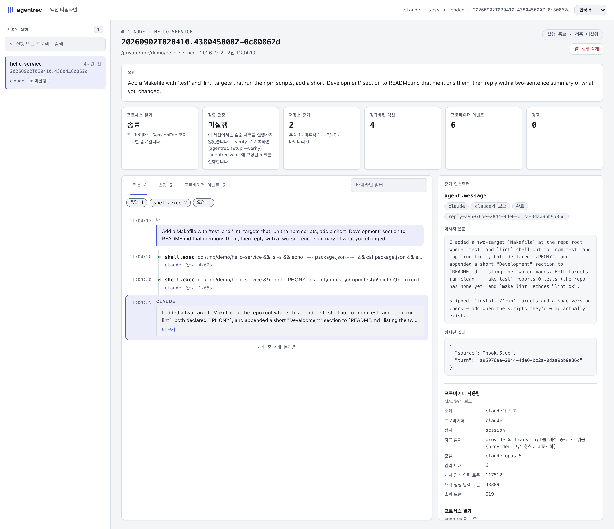
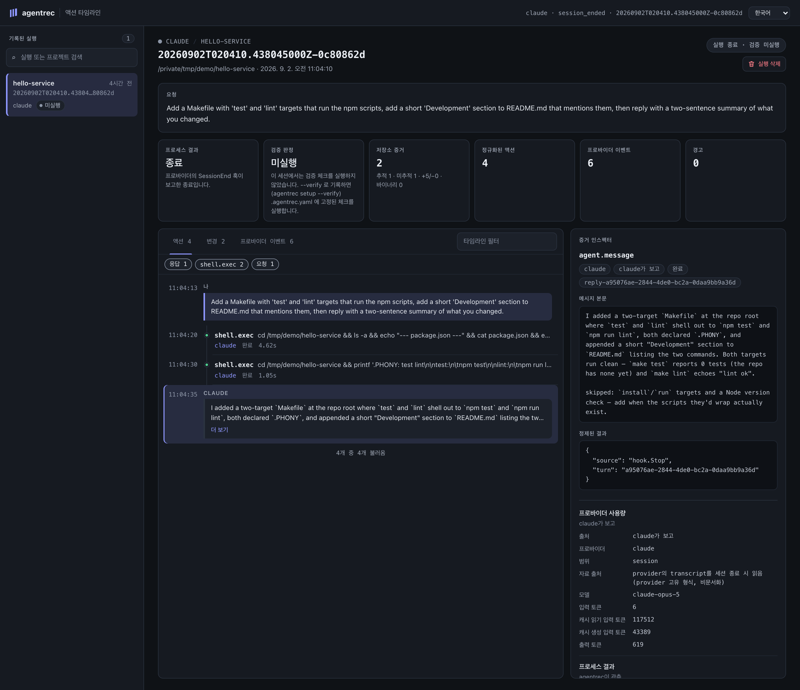

<p align="center">
  <a href="assets/agentrec-wordmark.svg"></a>
</p>

<table align="center">
  <tr>
    <td width="50%" align="center">
      <a href="assets/viewer-ko-light.png"></a><br>
      <sub><b>실행 하나를 다시 읽기.</b><br>에이전트가 말한 것, 프로세스가 한 것, 저장소가 보여주는 것, 체크가 돌려준 것을 서로 섞지 않고 보여줍니다.</sub>
    </td>
    <td width="50%" align="center">
      <a href="assets/agentrec-evidence-layers.svg"></a><br>
      <sub><b>관측자 넷, 출처 표기 넷.</b><br>어떤 것도 점수로 합치지 않고, 없는 증거를 통과로 바꾸지 않습니다.</sub>
    </td>
  </tr>
</table>

# agentrec

<div align="center">

[English](README.md) | 한국어 | [日本語](README.ja.md) | [简体中文](README.zh-CN.md)

[](https://github.com/seongwoo-choi/agentrec/actions/workflows/ci.yml)
[](https://github.com/seongwoo-choi/agentrec/releases)
[](https://go.dev/dl/)
[](LICENSE)
[](https://github.com/seongwoo-choi/agentrec)

</div>

<p align="center">
  <strong>코딩 에이전트의 모든 실행이, 터미널이 사라진 뒤에도 읽을 수 있는 출처 명시 로컬 증거 번들을 남깁니다.</strong><br>
  <em>agentrec이 직접 실행했든, 대화형 세션을 기록했든 마찬가지입니다. provider의 주장, 프로세스 결과, 저장소 변경, 고정된 체크 — 각각 다른 관측자에게서 오고, 점수로 합쳐지지 않습니다.</em>
</p>

**agentrec**은 Claude Code 또는 Codex 실행 한 번을 번들로 기록합니다. 정규화된
액션 타임라인, 감독한 프로세스의 결과, 실행 구간 동안의 저장소 차이, 그리고
저장소 스스로 고정해 둔 체크의 결과. 각각은 서로 다른 관측자에게서 오고, 번들은
이를 섞지 않습니다. 그래서 코드 리뷰, 장애 조사, 인수인계, 새 에이전트 버전을
믿을지에 대한 판단이 요약이 아니라 관측된 사실에서 출발합니다.

[릴리스 노트](docs/releases/v0.7.1.md) ·
[설계 노트](docs/plans/2026-07-27-agentrec-flight-recorder.md) ·
[Shadow runner 설계](docs/plans/2026-07-29-shadow-runner.md) ·
[Dogfood 증거](docs/dogfood/2026-07-28-evidence.md) ·
[서드파티 고지](THIRD_PARTY_NOTICES.md)

> [!NOTE]
> agentrec은 실시간 에이전트 frontend도, 클라우드 텔레메트리 서비스도, 관찰된
> 모든 파일 변경을 에이전트가 일으켰다는 증명도 아닙니다. 실행 하나를 둘러싼
> 로컬 증거 경계입니다. 무엇이, 누구에 의해 관측됐고, 무엇을 확정할 수 없는지를
> 말하기 때문에 쓸모가 있습니다.

## 빠른 시작

> **상태:** v0.7.0이 최신 릴리스입니다. run을 사후에 검증할 수 있습니다. 저장소에
> 커밋된 검사를 오늘 다시 실행하고, 그 결과를 별도의 사후 측정으로 기록하며 HEAD가
> 그동안 움직였는지 함께 남깁니다. 임의의 두 run을 화면에서 나란히 비교할 수도
> 있습니다. 저장소가 얼마나 드는지도 이제 말해 줍니다. `agentrec status`가 디스크
> 사용량을 알려주고, `agentrec trash sweep 30d`가 오래된 run을 휴지통으로 옮기며,
> 실행 중인 run을 따라갈 때 스트림 전체를 몇 초마다 다시 복사하지 않습니다.
>
> v0.6.0에서는 실행 중인 세션의 실시간 화면과 모든 run 검색이 추가됐고,
> v0.5.0에서는 휴지통으로의 삭제, 무한 스크롤, transcript 기반 사용량·모델, `UNAVAILABLE`
> 대신 세 단어, `--allow-run` 뒤의 화면 비교 실행이 추가됐고, v0.4.0에서는 프롬프트와
> 응답 기록, `agentrec setup`과 `agentrec start`, viewer의 네 개 언어가 추가됐으며,
> v0.3.0에서는 Claude Code와 Codex의 대화형 세션 기록이
> 추가됐고, 저장소 증거를 Git 기본값에 고정하며, redaction이 스트림 한도를 넘게
> 줄을 키우지 않습니다.

**설치 방법 하나를 고르세요. Homebrew가 가장 쉽습니다.**

```sh
brew install seongwoo-choi/tap/agentrec
agentrec version
```

```sh
archive=agentrec_0.7.0_darwin_arm64.tar.gz
awk -v file="$archive" '$2 == file { print }' SHA256SUMS | shasum -a 256 -c -
tar -xzf "$archive"
./agentrec_0.7.0_darwin_arm64/agentrec version
```

```sh
go install github.com/seongwoo-choi/agentrec/cmd/agentrec@v0.7.0
```

태그된 릴리스마다 `darwin_amd64`, `darwin_arm64`, `linux_amd64`, `linux_arm64`
아카이브와, 넷을 모두 덮는 `SHA256SUMS` 하나가 함께 올라갑니다. Linux에서는
`shasum -a 256 -c -` 대신 `sha256sum -c -`를 쓰세요. `agentrec version`은 태그,
커밋, UTC 빌드 시각을 출력합니다. 다른 방식으로 빌드한 바이너리는 `dev`라고
보고하므로 릴리스 바이너리와 혼동되지 않습니다. 소스 빌드에는 Go 1.26 이상이,
`shadow run`에는 Git 2.36 이상이 필요합니다.

**⭐ 검증 설정을 커밋하세요 (권장):**

```yaml
version: 1
verify:
  - name: go-test
    command: ["go", "test", "./...", "-count=1", "-timeout=420s"]
    timeout: 8m
  - name: go-vet
    command: ["go", "vet", "./..."]
    timeout: 5m
```

`.agentrec.example.yaml`을 `.agentrec.yaml`로 복사해 커밋하세요. 실행은 저장소가
이미 가지고 있던 체크에 대해서만 검증되며, 각 명령은 셸을 거치지 않고 직접
실행됩니다. 인자는 인자일 뿐 그 이상이 아닙니다.

**agentrec이 직접 실행하는 run을 기록하기:**

```sh
agentrec trace claude -- -p "add a regression test for the parser"
agentrec trace claude --verify -- -p "add a regression test for the parser"
agentrec trace claude --timeout 30m -- -p "add a regression test for the parser"
agentrec trace codex --verify -- exec "add a regression test for the parser"
agentrec trace claude --verify --allow-unsupported-version -- -p "..."
```

작업 디렉터리는 커밋되지 않은 변경과 진행 중인 작업이 없는 Git 체크아웃이어야
합니다. 그래야 실행이 만든 변경을 구분할 수 있습니다. 저장소당 trace는 한 번에
하나만 돌며, 두 번째는 대기열에 들어가지 않고 거부됩니다.

**이미 쓰고 있는 대화형 세션을 기록하기:**

```sh
agentrec setup
agentrec setup --claude --verify
agentrec setup --codex --project
agentrec hooks print --claude
```

터미널에서 `agentrec setup`은 어떤 에이전트를 기록할지(Claude Code, Codex, 둘 다),
세션이 끝날 때마다 `.agentrec.yaml`에 고정된 체크를 돌릴지(`--verify`), 사용자
파일(`~/.claude/settings.json`, `~/.codex/hooks.json`)에 쓸지 프로젝트
파일(`.claude/settings.json`, `.codex/hooks.json`)에 쓸지 묻습니다. 플래그를 주면
묻지 않습니다. 기존 hooks는 그대로 두고, 파일 옆에 백업을 남기며, 다시 실행해도
아무것도 바뀌지 않습니다. Codex는 새 hook을 신뢰하도록 Codex 안에서 `/hooks`를 한
번 실행해야 합니다. `hooks print`는 설치하지 않고 조각만 출력합니다. 그 뒤에 여는
모든 세션이 run으로 남습니다. 이미 열려 있던 세션은 기록되지 않습니다. 각
프롬프트와 각 최종 응답은 도구 호출 옆에 `PROMPT`, `MESSAGE` 줄로 기록되며
provider의 turn id로 짝지어집니다. v0.3.0에서 올라오셨다면 `agentrec setup`을 한
번 더 실행하세요. `Stop` hook만 추가하고 나머지는 건드리지 않습니다.

**다시 읽기 — 대부분은 브라우저가 편합니다:**

```sh
agentrec start
agentrec status
agentrec stop
agentrec view latest
agentrec list
agentrec show latest
agentrec events latest --json
```

`agentrec start`는 viewer를 백그라운드에서 `http://127.0.0.1:7788/`에 계속 띄워 두고
브라우저를 엽니다. `status`는 viewer가 돌고 있는지, run이 몇 개 기록됐는지, hooks가
설치됐는지 알려 주고, `stop`은 viewer를 끝냅니다. `view`는 같은 화면을
포그라운드로 띄웁니다. viewer에서 삭제한 run은 휴지통으로 가며, `agentrec trash`로
나열·복원·비우기를 할 수 있습니다. `--allow-run`으로 시작하면 viewer에서 비교 실행도
할 수 있습니다. "러너 비교" 패널에 저장소·작업·러너를 적으면 `agentrec shadow run`을
대신 실행하고, 출력과 기록된 두 run을 보여줍니다. 플래그가 없으면 패널은 복사할
명령만 만들어 줍니다. run이 아직 진행 중이면 그 페이지는 스스로 따라가며 지금의
작업 트리를 보여주고, 상단 검색창은 모든 run에서 단어를 찾아(어디서 실행됐는지,
프롬프트, 액션) 일치하는 액션 위치로 run을 엽니다.

| Provider | 실행 파일 | 지원 범위 | agentrec이 주입하는 것 |
| --- | --- | --- | --- |
| Claude Code | `claude` | `>=2.1.0, <3.0.0` | `trace`는 `-p`/`--print`를 요구하고 `--output-format stream-json --verbose --include-hook-events`를 추가 |
| Codex | `codex` | `>=0.144.0, <1.0.0` | `trace`는 `exec`가 첫 인자여야 하며 `--json`을 추가 |

범위 밖의 provider 버전은 이벤트 스트림이 여전히 맞으리라 가정하고 기록하지 않고
거부합니다. `--allow-unsupported-version`은 그래도 기록하되 manifest와 모든
리포트에 `versionUnverified`를 찍습니다. `shadow run`에는 이 우회가 없습니다.
제대로 읽힌 타임라인과 그렇지 않은 타임라인의 비교는 비교가 아니기 때문입니다.

## agentrec이 보여주는 것

<table align="center">
  <tr>
    <td width="50%" align="center">
      <a href="assets/viewer-ko-dark.png"></a><br>
      <sub><b><code>agentrec view</code>.</b> 같은 증거를 loopback 위에서 브라우저로 읽습니다. <code>agentrec show</code>는 같은 읽기를 증거 옆에 <code>report.md</code>로 남깁니다.</sub>
    </td>
    <td width="50%" align="center">
      <a href="assets/agentrec-evidence-layers.svg"></a><br>
      <sub><b><code>agentrec view</code>.</b> 같은 번들 위의 읽기 전용, loopback 전용 viewer.</sub>
    </td>
  </tr>
</table>

타임라인과 viewer가 눈앞에 놓아 주는 것:

- **액션 타임라인** — provider가 보고한 모든 tool call, 셸 명령, 파일 읽기와
  편집을 provider 간에 정규화해 보여주며, 각각 `Source`와 `Assurance`를 달고
  있습니다.
- **Change Explorer** — tracked, untracked, binary, 추가, 삭제 증거를 사용할 수
  없거나 손상된 캡처 상태와 분리합니다.
- **Unified Overview** — 프로세스 결과, 검증 판정, 저장소 증거, 액션, 이벤트,
  소요 시간, 경고를 한곳에 모으되 없는 증거를 성공으로 바꾸지 않습니다.
- **같은 경로 관측** — 파일 액션의 명시적 경로가 변경된 경로와 일치하면 연결하고
  `same path observed — not causal proof`로 표시합니다. 명령이나 결과 텍스트에서
  경로를 추론하지 않습니다.
- **provider 이벤트와 사용량** — 한도가 있는 provider 이벤트, 이벤트가 아닌
  stdout, provider가 보고한 토큰 사용량은 정규화된 액션과 분리해 둡니다.
- **두 run 나란히 보기** — 화면에서 다른 run을 골라 함께 읽습니다. provider, 모델,
  소요 시간, 사용량, 액션과 이벤트, 그리고 각자가 바꾼 파일을 여기만·저기만·양쪽
  으로 나눠 보여줍니다.
- **사후 검증** — 저장소에 커밋된 검사를 오늘 다시 실행할 수 있습니다. 화면에서도,
  `agentrec verify`로도 됩니다. 결과는 실행 시각과 그동안 HEAD가 움직였는지와 함께
  별도의 사후 측정으로 기록되며, run 자신의 판정은 그대로 남습니다.

## 네 가지 증거 계층

| 계층 | 관측자 | 의미 | 기록되는 출처 표기 |
| --- | --- | --- | --- |
| 🗣️ **Provider가 보고한 액션** | 에이전트 | 에이전트가 자기가 했다고 말한 것 — tool call, 셸 명령, 파일 읽기와 편집, MCP 호출, Codex 파일 변경. 정규화하고 요약할 뿐 증명으로 삼지 않습니다. | `provider_reported` |
| 👁️ **Supervisor가 관측한 결과** | agentrec | provider 프로세스가 어떻게 끝났는지: exit code, 종료 사유, signal, 소요 시간, 경고 수. agentrec이 시작하지 않은 세션에서는 `NOT OBSERVED`. | `supervisor_observed` |
| 🌳 **저장소에서 관측한 변경** | agentrec | 실행 전에 고정한 커밋과 실행 후 워크트리의 차이. agentrec이 직접 측정합니다. | `observed during run, not causal proof` |
| ✅ **검증에서 관측한 결과** | agentrec | provider가 멈춘 뒤 agentrec이 실행한, 저장소 스스로 고정한 체크가 어떻게 끝났는지. 작업이 어떻게 이루어졌는지는 말하지 않습니다. | `verification_observed` |

provider 진행 상황, 협업 대기, todo 목록 생명주기만 담은 이벤트는 스트림
메타데이터입니다. 액션을 나타내지 않고 경고 수를 부풀리지도 않습니다. provider
이벤트가 아예 아닌 stdout 줄 — 업데이트 배너, deprecation 경고 — 은
`provider-stdout.unparsed.log`에 보관되고, 다른 모든 것과 같이 redaction을 거치며,
manifest에 `unparsedLines`로 집계되고, 리포트에 언급됩니다. 실행을 실패시키지는
않습니다. 산문 한 줄을 출력한 provider도 실행은 한 것입니다.

## 두 가지 기록 방식

| | 🚀 `agentrec trace` | 🎧 대화형 세션 |
| --- | --- | --- |
| provider를 누가 시작하나 | agentrec이 부모 프로세스로 | 평소처럼 당신이. provider의 hook이 agentrec에 보고 |
| Supervisor가 관측한 결과 | exit code, signal, 소요 시간 | `NOT OBSERVED`. `Ended By`가 `SessionEnd` hook의 보고로 끝났는지, recorder가 기다리다 포기했는지(`session_lost`, hook 없이 8시간)를 말함 |
| baseline | 프로세스 시작 전에 고정 | `SessionStart` hook 도착 시점에 고정. `Window` 줄이 이를 명시 |
| 체크아웃 상태 | 깨끗해야 하고 저장소당 run 하나 | 커밋 안 된 변경이 있는 체크아웃과 동시 세션도 거부하지 않고 기록 |
| 검증 | `--verify`가 실행 전 `.agentrec.yaml`을 고정 | `--verify`로 출력한 조각에서만, 그리고 `.agentrec.yaml`이 추적 중이고 `HEAD`와 동일할 때만 |
| provider 이벤트 | agentrec이 읽는 이벤트 스트림 | `SessionStart`, `UserPromptSubmit`, `PostToolUse`, `PostToolUseFailure`, `SessionEnd` payload |

세션의 첫 hook이 그 세션의 recorder를 띄웁니다. recorder는 baseline을 고정하고,
hook이 전달하는 모든 이벤트를 받아 두었다가, 세션이 끝나면 run을 마무리합니다.
배송 하나가 그 뒤의 기록을 끝내는 일은 없고, 같은 ID로 재개된 세션은 자기만의
recorder를 얻습니다. 액션은 provider의 `tool_use_id`와 `duration_ms`를 담고,
서브에이전트의 호출은 `agent_id`를 담습니다. 세션이 비활성화한 hook은 공백을 남길
뿐, 아무 일도 없었다는 뜻이 아닙니다.

Codex는 `PostToolUseFailure`를 보내지 않으므로 실패한 명령은 응답에 실패가 적힌
완료 액션으로 남고, `apply_patch` 편집은 패치 헤더에 파일을 적으므로 저장소 경로는
거기서 옵니다. payload 형태는 Codex 0.150.1의 `codex exec`에서 확인했고, 대화형
TUI의 hook도 같은 문서화된 계약을 따릅니다.

## 명령

| 명령 | 하는 일 |
| --- | --- |
| 🚀 `agentrec trace <claude\|codex> [--verify] [--allow-unsupported-version] [--timeout <d>] -- <args...>` | agentrec이 직접 실행하고 감독하는 비대화형 run 하나를 기록합니다. |
| 🧩 `agentrec setup [--claude] [--codex] [--verify] [--project] [--uninstall]` | 대화형 세션을 기록하는 hooks를 설치합니다. 플래그 없이 터미널에서 실행하면 어떤 에이전트인지, 검증할지, 어디에 쓸지 묻습니다. |
| ▶️ `agentrec start [--listen <loopback-address>] [--no-open] [--allow-run]` | viewer를 백그라운드로 띄우고 브라우저를 엽니다. `--allow-run`이면 화면에서 비교 실행을 시작할 수 있습니다. |
| ⏹️ `agentrec stop` | 백그라운드 viewer를 종료합니다. |
| ℹ️ `agentrec status` | viewer 상태, 기록된 run 수, hooks 설치 여부를 보여줍니다. |
| 🗑️ `agentrec trash [restore <run-id> \| empty \| sweep <age>]` | viewer에서 삭제한 run을 나열하거나, 하나를 되살리거나, 전부 지우거나, `30d`처럼 지정한 나이보다 오래된 run을 휴지통으로 옮깁니다(`--dry-run`은 대상만 나열). |
| ✅ `agentrec verify <run-id>\|latest` | 저장소에 커밋된 검증 설정을 지금, 오늘의 저장소 상태를 대상으로 실행하고 그 결과를 사후 측정으로 run 옆에 기록합니다(`--allow-run`으로 띄운 viewer는 run 페이지에서 같은 일을 합니다). |
| 🎧 `agentrec hooks print --claude\|--codex [--verify]` | `setup`이 설치할 hooks 조각을 출력합니다. 손으로 설치할 때 씁니다. |
| ⚖️ `agentrec shadow run <task-file> --runner claude --runner codex` | 하나의 작업을 같은 커밋에서 격리된 worktree 두 곳에 두 번 기록합니다. |
| ⚖️ `agentrec shadow show <group-id>` | 기록된 비교를 증거만으로 다시 렌더합니다. |
| 📋 `agentrec list [--cwd <path>] [--exit-reason <reason>] [--verification-status <status>]` | run을 최신순으로 나열합니다. |
| 📄 `agentrec show <run-id>\|latest` | 번들에서 run 하나를 렌더합니다. 아무것도 쓰지 않습니다. |
| 🧾 `agentrec events <run-id>\|latest [--json]` | 기록된 provider 이벤트를 요약하거나 덤프합니다. |
| 🖥️ `agentrec view [<run-id>\|latest] [--listen <loopback-address>] [--no-open] [--allow-run]` | 읽기 전용 viewer를 loopback에 띄웁니다. |
| 🏷️ `agentrec version` | 태그, 커밋, UTC 빌드 시각을 출력합니다. |

`agentrec hook <provider>`와 `agentrec session serve`도 있습니다. 앞의 것은
provider가 실행하고, 뒤의 것은 첫 hook이 띄웁니다. 둘 다 직접 입력하는 명령이
아닙니다.

## 리포트는 이렇게 생겼습니다

`agentrec show`는 읽기 전용입니다. 번들에서 run을 렌더할 뿐 아무것도 쓰지
않습니다. 실제 기록된 run(`582ee874`)에서 액션 하나만 남기고 발췌:

```
PROVIDER-REPORTED ACTIONS
09:34:32  EDIT  /Users/csw/code/agentrec/README.md
  Source       claude
  Assurance    provider_reported
  Result       success
  Duration     1.128s

SUPERVISOR-OBSERVED RESULT
  Provider     claude
  Version      2.1.220
  Exit Reason  completed
  Exit Code    0
  Duration     2m50.625s
  Warnings     0

REPOSITORY-OBSERVED CHANGES
  Status       AVAILABLE
  Files        1 (1 tracked, 0 untracked)
  Diff         +18/-1, 0 binary
  Stored Text  0
  Baseline     43d37240e960ad2f321276045b2bb8d710f5a4db
  Attribution  observed during run, not causal proof

VERIFICATION-OBSERVED RESULT
  Status       PASS
  Config       .agentrec.yaml
  Config SHA-256 e20695bb3ebee3381b54da6fc46b6b1efa1adc9b87a5eb99b45505b5dbdfae3f
  Check        PASS go-test  "go" "test" "./..." "-count=1" "-timeout=420s"  42.486s  exit 0
  Check        PASS go-vet  "go" "vet" "./..."  348ms  exit 0
  Attribution  verification_observed
```

`agentrec trace`는 같은 번들의 같은 읽기를 무엇을 출력하기 전에 `<run>/report.md`에
씁니다. 단 한 번이고 다시 쓰지 않습니다. 그 이름에 이미 리포트가 있으면 덮어쓰지
않고 거부합니다.

## 두 에이전트를 한 작업으로 비교하기

```sh
agentrec shadow run task.md --runner claude --runner codex
agentrec shadow show <group-id>
```

`shadow run`은 하나의 작업을 두 번 기록합니다. Claude Code로 한 번, Codex로 한 번,
같은 커밋된 baseline에서, 각각 `$AGENTREC_HOME/shadow/<group>/workspaces/<runner>`
아래의 일회용 detached Git worktree에서 실행하고, 그 leg의 증거가 닫히면
worktree를 제거합니다. 두 leg 모두 평범한 run 번들을 남깁니다. 비공개 `group.json`은
baseline, leg 순서, run ID, 결과를 보관하되 작업 본문은 담지 않습니다. 비교는
runner마다 블록 하나를 — run ID, 검증과 고정된 설정, 프로세스 결과, 저장소 변경,
액션 수 — 항상 `claude`, `codex` 순으로 출력하고, `Order`가 실제로 어느 쪽이 먼저
돌았는지를 기록합니다.

| 주는 것 | 주지 않는 것 |
| --- | --- |
| 같은 커밋에서, 같은 커밋된 `.agentrec.yaml`로 검증한, 차례로 실행된 두 run | 점수, 승자, 추천 — 판단은 읽는 사람의 몫 |
| leg 사이의 간섭을 줄이는 격리 | 인과 귀속 — 각 변경은 여전히 `observed during run, not causal proof` |
| leg마다 끝난 뒤 소스 드리프트 감지(`HEAD`, status, index, refs, worktrees, config) 후 다음 leg 중단 | sandbox — linked worktree는 공용 Git 디렉터리를 공유하고, untracked `.env` 파일은 복사되지 않음 |
| 아무것도 만들기 전 거부는 종료 코드 `2`, leg 결과는 `0`/`1`, 인터럽트는 `130` | provider 자체의 종료 코드 — 그건 번들 안의 증거이며 전달되지 않음 |

커밋된 `.gitmodules`나 Git LFS 포인터 파일은 체크아웃이 생기기 전에 거부됩니다.
작업은 최대 64 KiB의 일반 UTF-8 파일 하나이며, 각 에이전트에 인자 하나로
전달됩니다. agentrec이 강제 종료되면 소스 저장소에서 `git worktree prune`을 실행하고
`$AGENTREC_HOME/shadow` 아래 남은 디렉터리를 지워 복구하세요. 오래된 worktree를
자동으로 정리하지는 않습니다.

## 주장보다 증거

agentrec은 직접 본 것만 일어났다고 말합니다. 상태는 기록된 그대로 보여주며
추론하지 않습니다:

| 표시 | 의미 |
| --- | --- |
| `AVAILABLE` | 저장소를 측정했습니다. 개수는 이때만 표시됩니다. |
| `NOT RUN` | 이 run에는 검증을 요청하지 않았습니다. 중립이며 통과가 아닙니다. |
| `NOT OBSERVED` | 감독한 프로세스가 없습니다. agentrec이 시작하지 않은 세션이라 exit code와 signal을 보지 못했습니다. |
| `NOT RECORDED` | 저장소 측정이 만들어지지 않았습니다. 중립이며 통과가 아닙니다. |
| `PENDING` | 실행 전에 쓰였고 끝내 답을 받지 못했습니다. 0은 *측정하지 않음*이지 *없음으로 측정*이 아닙니다. |
| `PASS` / `FAIL` / `TIMEOUT` / `ERROR` | 실행이 남긴 트리 위에서 고정된 체크가 어떻게 끝났는지. |
| `TAINTED` | 고정한 뒤 실행이 `.agentrec.yaml`을 고쳐 썼습니다. **아무것도 실행하지 않았고** 체크는 `PENDING`으로 남습니다. |
| `(none)` | 검증을 요청하지 않았습니다. 통과한 체크가 아닙니다. |
| `completed` / `nonzero` / `timeout` / `interrupted` | agentrec이 본 감독 프로세스의 종료 방식. |
| `session_ended` / `session_lost` | 세션의 `SessionEnd` hook이 종료를 보고했거나, recorder가 기다림을 멈췄습니다. |
| `running` | 세션이 아직 열려 있고 recorder가 살아 있습니다. |
| `unknown` | recorder가 세션이 어떻게 끝났는지 적지 못한 채 끝났습니다. |

| 종료 코드 | 의미 |
| --- | --- |
| `0` | provider가 완료했고 검증이 있었다면 통과했습니다. |
| `1`–`125` | `trace`가 그대로 전달한 provider 자체의 종료 코드. |
| `1` | 기록, 렌더, 검증이 실패했습니다. |
| `2` | agentrec을 잘못 호출했습니다. |
| `130` | 인터럽트됐습니다. |

`--timeout`은 provider 프로세스만 제한합니다. 기한이 되면 프로세스 그룹에 SIGTERM을
보내고 5초를 기다린 뒤 SIGKILL을 보내며, run은 `timeout`으로 남깁니다. Ctrl-C와
SIGTERM은 기록 전체에 걸쳐 그 자리에서 따르지 않고 붙들어 둡니다. provider 그룹을
멈추고, 저장소를 측정하고, 체크를 돌리고, 리포트를 남긴 뒤 `130`으로 종료하므로
`PENDING`에 멈춰 선 run이 남지 않습니다. 붙드는 것은 첫 시그널까지입니다. 두 번째는
그 자리에서 프로세스를 끝냅니다. `process/result.json`은 프로세스가 종료했으면 exit
code를, 시그널로 죽었으면 그 시그널을 기록하며 어느 쪽도 다른 쪽에서 추론하지
않습니다.

agentrec이 주장하지 않는 것:

- **syscall 수준으로 완전하지 않습니다.** 에이전트가 일하는 동안 아무것도
  지켜보지 않습니다. 기록은 provider가 보고한 것, 실행 전후의 저장소 모습, 나중에
  독립적인 체크가 말한 것입니다.
- **저장소 변경은 인과 귀속이 아닙니다.** 체크아웃을 건드린 다른 무엇이든 같은
  변경에 섞이며, 모든 리포트가 이를 말합니다.
- **세션의 종료는 provider의 말입니다.** 당신 권한으로 도는 무엇이든 `SessionEnd`를
  보낼 수 있고, 리포트는 누가 run을 끝냈는지 말합니다.
- **policy engine도, sandbox도, 원격 업로드도 없습니다.** agentrec은 관찰하고
  로컬에 씁니다. Windows는 빌드되지도 검증되지도 않았고, macOS와 Linux를 지원합니다.

## 보안

- **viewer는 브라우저가 아니라 머신을 신뢰합니다.** 인증 없이 loopback에서 듣기
  때문에, 이 머신에서 loopback에 닿는 프로세스라면 모든 run을 읽을 수 있고, v0.5.0부터는
  휴지통으로 옮길 수도 있습니다. 브라우저의 다른 출처 페이지는 그럴 수 없습니다.
  삭제와 복원에는 viewer 페이지만 읽을 수 있는 토큰이 필요하고, 그 토큰은 cross-site
  요청이 실을 수 없는 헤더로 보내며, same-origin fetch만 받습니다. viewer는 아무것도
  지우지 않습니다. `agentrec trash empty`만 지웁니다. `--allow-run`을 켜면 loopback에
  닿는 프로세스가 원하는 저장소에서 당신의 권한으로 `agentrec shadow run`을 시작할
  수도 있습니다. 그걸 원하지 않으면 플래그를 끄세요.
- **저장 전 구조적 redaction.** provider 이벤트, stderr, 이벤트가 아닌 stdout은
  쓰이기 전에 redaction을 거칩니다. 정규화된 이름이 17개 비밀 접미사(`TOKEN`,
  `SECRET`, `PASSWORD`, `APIKEY`, `PASSPHRASE`, `AUTHORIZATION`, `COOKIE`, …) 중
  하나로 끝나는 필드의 값, `NAME=VALUE` 할당, 13종 벤더 토큰 형태(GitHub, OpenAI,
  AWS, Google, Stripe, JWT, Slack, GitLab, npm, Hugging Face, PyPI)가 `[REDACTED:n]`이
  됩니다. 부분 문자열이 아니라 접미사로 맞추기 때문에 `PUBLIC_KEY`, `primaryKey`,
  `token_id`는 읽을 수 있게 남습니다. 규칙 버전은 manifest마다 찍히며, 다른 규칙으로
  판정된 번들끼리는 redaction 수를 비교할 수 없습니다.
- **redaction 0건은 비밀이 없다는 주장이 아닙니다.** 이름 없는 필드, 산문 속,
  최소 길이보다 짧은 비밀은 모두 같은 0을 냅니다.
- **untracked 파일 본문은** `git/untracked/` 아래에 저장되며, 해시는 소독된 텍스트
  기준입니다. 원문 해시는 짧은 비밀을 추측으로 되돌려 줍니다.
- **리포트는 원본 이벤트 스트림, tracked 패치, untracked 본문을 절대 포함하지
  않습니다.** 액션은 라벨 하나, 허용된 세부 필드 하나, 제어 문자를 이스케이프한
  고정 요약 필드로 줄어들므로 어떤 provider 문자열도 타임라인 행을 위조하거나
  터미널을 조종할 수 없습니다. 번들은 방어적으로 읽습니다. 심링크는 거부하고,
  크기, 줄 길이, 항목 수를 제한합니다.
- **저장소 증거는 Git 기본값에 고정됩니다.** tracked diff는 textconv, 색상,
  prefix, context, 알고리즘, indent heuristic을 고정한 채 돌고, 모든 증거 명령은
  `core.fsmonitor`를 끄고 실행되므로 저장소 attributes나 운영자 설정이 패치를 다시
  쓸 수 없습니다.
- **viewer는 읽기 전용이고, loopback에만 바인드하며, 외부 에셋을 불러오지
  않습니다.** 같은 호스트의 다른 사용자에 대해 인증하지는 않습니다.
- **릴리스 아카이브는 체크섬만 있고 서명은 없습니다.** `SHA256SUMS`는 산출물의
  동일성을 보장할 뿐 배포자의 신원을 보장하지 않습니다.

## 실행이 저장되는 위치

`$AGENTREC_HOME/runs`가 설정돼 있으면 그곳, 아니면 `~/.local/share/agentrec/runs`.
run 디렉터리는 `0700`으로, 안의 모든 파일은 `report.md`까지 `0600`으로 만들어집니다.
번들이 비공개 저장소를 인용할 수 있기 때문입니다. run마다 디렉터리 하나에
`manifest.json`, `prompt.txt`, 소독된 이벤트 스트림과 stderr, `actions.jsonl`,
`process/result.json`(trace run만), `git/`(baseline, result, untracked 본문),
`verification/results.json`, `report.md`가 들어갑니다.
`provider-stdout.unparsed.log`는 provider가 이벤트가 아닌 무언가를 stdout에 출력했을
때만, `verification-posthoc/`는 run을 사후에 검증했을 때만 추가됩니다. 화면에서 지운
run은 `agentrec trash empty` 전까지 `trash/`에서 기다리고, 실행 중인 viewer는 스트림
사본을 `viewer-cache/` 아래 자기 디렉터리에 두었다가 종료할 때 지웁니다.
`AGENTREC_HOME`은 기록 대상 저장소 밖에 있어야 하며, 대화형 recorder는 소켓과 lock을
시스템 임시 디렉터리 아래에 둡니다.

## 문서

- [v0.7.1 릴리스 노트](docs/releases/v0.7.1.md) · [v0.7.0](docs/releases/v0.7.0.md) · [v0.6.0](docs/releases/v0.6.0.md) · [v0.5.0](docs/releases/v0.5.0.md) · [v0.4.0](docs/releases/v0.4.0.md) · [v0.3.0](docs/releases/v0.3.0.md) · [v0.2.0](docs/releases/v0.2.0.md) · [v0.1.0](docs/releases/v0.1.0.md)
- [플라이트 레코더 설계](docs/plans/2026-07-27-agentrec-flight-recorder.md)
- [Shadow runner 설계](docs/plans/2026-07-29-shadow-runner.md)
- [Dogfood 증거 — recorder](docs/dogfood/2026-07-28-evidence.md): 고정된 20회
  시도 체크포인트와 실제 변형 실행. 검증 `FAIL`, provider nonzero, 설정 `TAINTED`,
  인터럽트, 그리고 그 실행들이 **확정하지 않는** 것까지 다룹니다.
- [Dogfood 증거 — shadow run](docs/dogfood/2026-07-29-shadow-evidence.md): 같은
  커밋에서 Claude Code와 Codex를 상대로 한 macOS 실행 1회.
- [서드파티 고지](THIRD_PARTY_NOTICES.md)

## 개발

```sh
npm ci --include=dev
npm run test:ui
go test ./... -count=1 -timeout=420s
go test -race ./... -count=1 -timeout=600s
go vet ./...
gofmt -l .
go build ./...
scripts/build-release.sh v0.7.0 "$(git rev-parse HEAD)" "$(date -u +%Y-%m-%dT%H:%M:%SZ)" dist
```

`scripts/build-release.sh`는 릴리스 아카이브를 로컬에서 빌드할 뿐 아무것도
발행하지 않습니다. 출력 디렉터리는 미리 존재하면 안 됩니다.
`.github/workflows/release.yml`은 `v*.*.*` 태그에서 같은 스크립트를 실행하고, 모든
아카이브의 목록과 빌드한 바이너리의 version 출력을 확인한 뒤에야 발행합니다. 이미
존재하는 릴리스에 대해서는 실행을 거부합니다. 공개 Homebrew tap은 새 릴리스마다
실제 `brew install`과 `brew test`로 검증한 뒤 formula를 갱신합니다.

## 번역 유지 관리

`README.md`가 사실 기준의 원본 문서입니다. 번역된 README는 단어 대 단어 번역이
아니라 독자를 위해 쓰되, 명령, 링크, 지원 버전 범위, 그리고 모든 출처 표기와 안전
문구를 보존해야 합니다. 자연스러운 산문은 여전히 원어민 검토가 필요합니다. 아래
검사기는 자동화가 증명할 수 있는 것만 확인합니다. 제목 구조, 실행 가능한 코드
블록, 외부 링크 대상입니다.

```sh
python3 scripts/check-readme-localizations.py
sh scripts/check-readme-localizations_test.sh
```

## 라이선스

agentrec은 [MIT License](LICENSE)로 제공됩니다. 서드파티 저작권 표시와 의존성
라이선스는 [THIRD_PARTY_NOTICES.md](THIRD_PARTY_NOTICES.md)에 보존됩니다.
