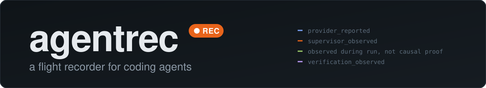
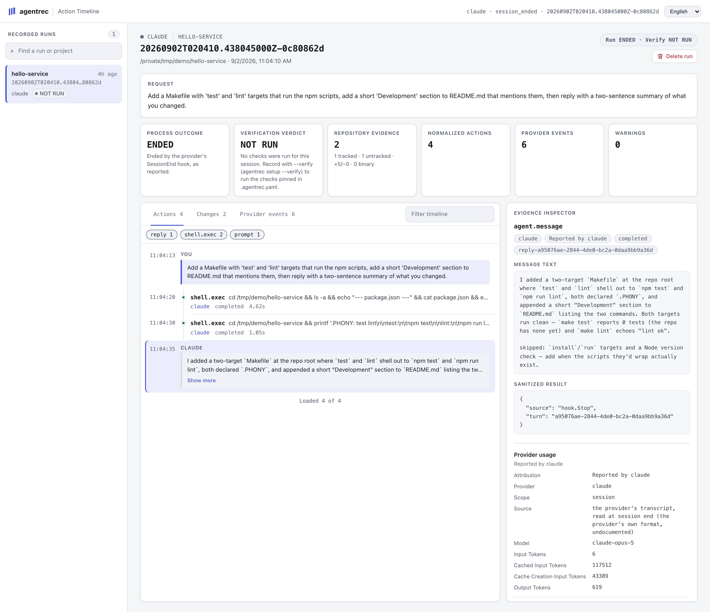
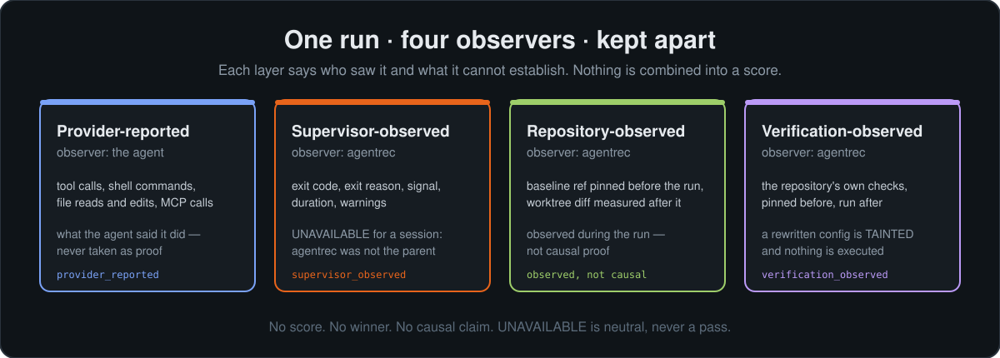
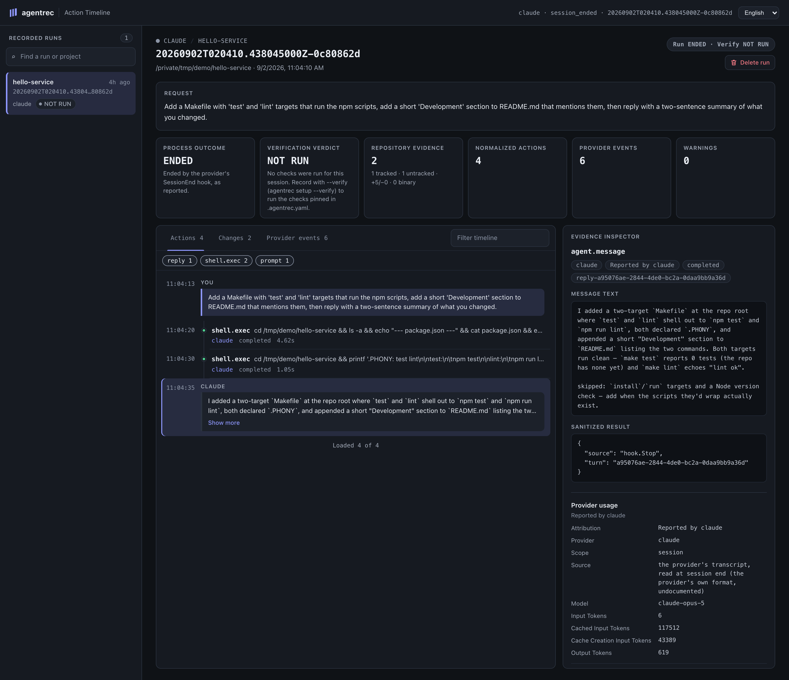

<p align="center">
  <a href="assets/agentrec-wordmark.svg"></a>
</p>

<table align="center">
  <tr>
    <td width="50%" align="center">
      <a href="assets/viewer-en-light.png"></a><br>
      <sub><b>一次运行，事后回读。</b><br>智能体说了什么、进程做了什么、仓库呈现了什么、检查返回了什么，分开呈现，互不混淆。</sub>
    </td>
    <td width="50%" align="center">
      <a href="assets/agentrec-evidence-layers.svg"></a><br>
      <sub><b>四个观察者，四种归属。</b><br>不会合并成一个评分，缺失的证据也绝不算作通过。</sub>
    </td>
  </tr>
</table>

# agentrec

<div align="center">

[English](README.md) | [한국어](README.ko.md) | [日本語](README.ja.md) | 简体中文

[](https://github.com/seongwoo-choi/agentrec/actions/workflows/ci.yml)
[](https://github.com/seongwoo-choi/agentrec/releases)
[](https://go.dev/dl/)
[](LICENSE)
[](https://github.com/seongwoo-choi/agentrec)

</div>

<p align="center">
  <strong>每次编码智能体运行都会留下一个带有来源归属的本地证据包，即使终端会话结束后仍可查阅。</strong><br>
  <em>无论是由 agentrec 启动，还是从交互式会话中记录。提供方的主张、进程结果、仓库差异和固定检查——各自来自不同的观察者，绝不合并成一个评分。</em>
</p>

**agentrec** 会将一次 Claude Code 或 Codex 运行记录为一个证据包：规范化的操作时间线、
受监管进程的结果、运行窗口内仓库前后的差异，以及仓库自身固定检查的结果。这些信息由
不同的观察者获得，证据包会将它们明确区分开来。因此，无论是代码审查、事故调查、工作
交接，还是决定是否信任新版智能体，都能从实际观察到的事实出发，而不是从一份摘要出发。

[发布说明](docs/releases/v0.7.0.md) ·
[设计笔记](docs/plans/2026-07-27-agentrec-flight-recorder.md) ·
[Shadow runner 设计](docs/plans/2026-07-29-shadow-runner.md) ·
[Dogfood 证据](docs/dogfood/2026-07-28-evidence.md) ·
[第三方声明](THIRD_PARTY_NOTICES.md)

> [!NOTE]
> agentrec 不是用于实时操控智能体的交互式 frontend，不是云端遥测服务，也不能证明
> 智能体导致了每一处观察到的文件变更。它是围绕一次运行建立的本地证据边界，其价值
> 恰恰在于它会说明观察到了什么、由谁观察到，以及它无法证明什么。

## 快速开始

> **状态：** v0.7.0 是最新发布版本。运行记录可以事后再验证一次——仓库中已提交的检查
> 今天重新运行，作为独立的事后测量记录下来，并说明 HEAD 在此期间是否移动过——任意
> 两条运行记录也可以在页面上并排比较。存储的开销现在也能看见：`agentrec status` 会
> 报告它占用的磁盘空间，`agentrec trash sweep 30d` 会把陈旧的运行记录移入回收站，跟随
> 一条正在运行的记录时也不再每隔几秒重新复制整个流。
>
> v0.6.0 新增了正在运行会话的实时视图，以及跨所有运行记录的搜索；v0.5.0 新增了把运行
> 记录删除到回收站、无限滚动、从 transcript 读取用量和模型、取代 `UNAVAILABLE` 的三个
> 直白的词，以及在启用 `--allow-run` 时从页面发起比较；v0.4.0 新增了
> 对提示词和回复的记录、`agentrec setup` 与 `agentrec start`，以及查看器的四种语言；
> v0.3.0 新增了 Claude Code 与 Codex 的交互式会话记录，把仓库证据固定到 Git 默认值，
> 并防止脱敏把一行放大到超过流上限。

**任选一种安装方式。Homebrew 最简单。**

```sh
brew install seongwoo-choi/tap/agentrec
agentrec version
```

```sh
archive=agentrec_0.7.0_darwin_arm64.tar.gz
awk -v file="$archive" '$2 == file { print }' SHA256SUMS | shasum -a 256 -c -
tar -xzf "$archive"
./agentrec_0.7.0_darwin_arm64/agentrec version
```

```sh
go install github.com/seongwoo-choi/agentrec/cmd/agentrec@v0.7.0
```

每个已打标签的发布版本都包含 `darwin_amd64`、`darwin_arm64`、`linux_amd64` 和
`linux_arm64` 四个归档，以及一份覆盖全部四个归档的 `SHA256SUMS`。在 Linux 上请用
`sha256sum -c -` 代替 `shasum -a 256 -c -`。`agentrec version` 会输出标签、提交和
UTC 构建时间；以其他方式构建的二进制会显示 `dev`，因此未加构建信息的二进制不会被
误认为发布版。从源码构建需要 Go 1.26 或更高版本；`shadow run` 还需要 Git 2.36 或
更高版本。

**⭐ 提交验证配置（推荐）：**

```yaml
version: 1
verify:
  - name: go-test
    command: ["go", "test", "./...", "-count=1", "-timeout=420s"]
    timeout: 8m
  - name: go-vet
    command: ["go", "vet", "./..."]
    timeout: 5m
```

将 `.agentrec.example.yaml` 复制为 `.agentrec.yaml` 并提交。一次运行只会依据仓库
原本已有的检查进行验证，且每条命令都直接启动、不经 shell：参数始终只是参数，不会
被当作其他内容解释。

**记录一次由 agentrec 启动的运行：**

```sh
agentrec trace claude -- -p "add a regression test for the parser"
agentrec trace claude --verify -- -p "add a regression test for the parser"
agentrec trace claude --timeout 30m -- -p "add a regression test for the parser"
agentrec trace codex --verify -- exec "add a regression test for the parser"
agentrec trace claude --verify --allow-unsupported-version -- -p "..."
```

工作目录必须是没有未提交变更、也没有进行中操作的 Git 检出，以便区分本次运行自身
造成的变更。每个仓库同一时间只能有一次被跟踪的运行；第二次会被拒绝，不会排队。

**记录你已经在用的交互式会话：**

```sh
agentrec setup
agentrec setup --claude --verify
agentrec setup --codex --project
agentrec hooks print --claude
```

在终端中，`agentrec setup` 会询问要记录哪个智能体（Claude Code、Codex 或两者）、是否在
每次会话结束后运行 `.agentrec.yaml` 中固定的检查（`--verify`），以及写入你的用户文件
（`~/.claude/settings.json`、`~/.codex/hooks.json`）还是项目文件（`.claude/settings.json`、
`.codex/hooks.json`）。带上标志即可跳过提问。已有的 hooks 会被保留，备份会写在原文件
旁边，再次运行不会有任何改动。Codex 需要在 Codex 内执行一次 `/hooks` 来信任新的 hook。
`hooks print` 只显示片段而不安装。此后打开的每个会话都会作为一次运行被归档；已经打开
的会话不会。每条提示词和每条最终回复都会记在工具调用旁边，以 `PROMPT` 和 `MESSAGE`
行的形式出现，并按提供方的 turn id 配对。从 v0.3.0 升级？再运行一次 `agentrec setup`：
它只添加 `Stop` hook，不会改动其他任何内容。

**回读记录——在浏览器中查看，多数人会更喜欢这种方式：**

```sh
agentrec start
agentrec status
agentrec stop
agentrec view latest
agentrec list
agentrec show latest
agentrec events latest --json
```

`agentrec start` 会让查看器在后台持续运行于 `http://127.0.0.1:7788/` 并打开它；`status`
会说明查看器是否在运行、已记录多少次运行以及 hooks 是否已安装；`stop` 会结束它。`view`
在前台提供同样的页面。在查看器中删除的运行记录会进入回收站，`agentrec trash` 可以列出、
恢复或清空它。以 `--allow-run` 启动时，查看器还能运行比较：在“比较运行器”面板里填入
仓库、任务和运行器，它会替你启动 `agentrec shadow run`，并展示其输出以及记录下的两条
运行记录。没有该标志时，面板只会把命令写出来供你复制。当一次运行仍在进行时，它的页面
会自行跟进，并展示此刻的工作树；顶栏的搜索框会在每一条运行记录中查找一个词——它发生在
哪里、它的提示词、它的操作——并在匹配的操作处打开该运行记录。

| 提供方 | 可执行文件 | 支持范围 | agentrec 注入的内容 |
| --- | --- | --- | --- |
| Claude Code | `claude` | `>=2.1.0, <3.0.0` | `trace` 要求 `-p`/`--print`，并添加 `--output-format stream-json --verbose --include-hook-events` |
| Codex | `codex` | `>=0.144.0, <1.0.0` | `trace` 要求 `exec` 为第一个参数，并添加 `--json` |

超出支持范围的提供方版本会被拒绝，而不是假定其事件流仍然兼容就继续记录。
`--allow-unsupported-version` 会照常记录，并在 manifest 和每份报告中标记
`versionUnverified`；`shadow run` 没有这样的覆盖选项，因为一条被正确读取的时间线
与一条未被正确读取的时间线之间的比较，算不上比较。

## agentrec 会向你展示什么

<table align="center">
  <tr>
    <td width="50%" align="center">
      <a href="assets/viewer-en-dark.png"></a><br>
      <sub><b><code>agentrec view</code>。</b>同样的证据，在回环地址上通过浏览器回读；<code>agentrec show</code> 会把同一份读取结果以 <code>report.md</code> 的形式与证据一起归档。</sub>
    </td>
    <td width="50%" align="center">
      <a href="assets/agentrec-evidence-layers.svg"></a><br>
      <sub><b><code>agentrec view</code>。</b>基于同一证据包的只读、仅回环地址的查看器。</sub>
    </td>
  </tr>
</table>

时间线和查看器会呈现以下内容：

- **操作时间线**——提供方报告的每次工具调用、shell 命令、文件读取和编辑，跨提供方
  规范化，每一条都带有各自的 `Source` 和 `Assurance`。
- **Change Explorer**——已跟踪、未跟踪、二进制、新增和删除的证据，与不可用或格式
  异常的采集状态分开呈现。
- **统一概览**——进程结果、验证结论、仓库证据、操作数、事件数、耗时和警告集中显示，
  但不会把不可用的证据转换为成功。
- **同路径观察**——文件操作的明确路径与某个变更路径一致时，两者会被关联并标注
  `same path observed — not causal proof`；绝不会从命令或结果文本中推断路径。
- **提供方事件与用量**——受限的提供方事件、非事件 stdout 以及提供方报告的 token
  用量，与规范化操作保持分离。
- **两条运行记录并排**——在页面上任选另一条运行记录一起阅读：提供方、模型、时长、
  用量、操作与事件，以及各自改动的文件，分为仅此处、仅彼处与两者皆有。
- **事后验证**——仓库中已提交的检查今天可以重新运行，既可从页面发起，也可用
  `agentrec verify`。结果连同运行时刻以及 HEAD 在此期间是否移动，一并作为独立的
  事后测量记录下来；运行记录本身的判定保持原样。

## 四个证据层

| 层 | 观察者 | 含义 | 记录的归属 |
| --- | --- | --- | --- |
| 🗣️ **提供方报告的操作** | 智能体 | 智能体声称执行过的操作：工具调用、shell 命令、文件读写、MCP 调用和 Codex 文件变更。会被规范化和汇总，但绝不视为证明。 | `provider_reported` |
| 👁️ **监管方观察到的结果** | agentrec | 提供方进程如何结束：退出码、退出原因、信号、耗时和警告数量。对于不是由 agentrec 启动的会话，显示为 `NOT OBSERVED`。 | `supervisor_observed` |
| 🌳 **仓库观察到的变更** | agentrec | 运行前固定的提交与运行后工作树之间的差异，由 agentrec 自行测量。 | `observed during run, not causal proof` |
| ✅ **验证观察到的结果** | agentrec | 提供方停止后，agentrec 运行仓库自身固定检查时得到的结果。它并不说明工作是如何完成的。 | `verification_observed` |

仅包含提供方进度、协作等待或待办列表生命周期的事件属于流元数据：它们不对应具体
操作，也不会增加警告数。完全不是提供方事件的 stdout 行——例如更新横幅、弃用警告——
会保存在 `provider-stdout.unparsed.log` 中，与其他内容一样经过脱敏处理，在 manifest
中按 `unparsedLines` 计数，并在报告中注明。这不会导致运行失败：即使提供方只额外
输出了一行文本，它仍然完成过运行。

## 两种记录方式

| | 🚀 `agentrec trace` | 🎧 交互式会话 |
| --- | --- | --- |
| 谁启动提供方 | agentrec，作为父进程 | 一如往常由你启动；提供方的 hook 向 agentrec 报告 |
| 监管方观察到的结果 | 退出码、信号、耗时 | `NOT OBSERVED`；`Ended By` 会说明是 `SessionEnd` hook 报告了结束，还是 recorder 放弃等待（`session_lost`，在 8 小时没有 hook 之后） |
| 基线 | 在进程启动前固定 | 在 `SessionStart` hook 到达时固定；`Window` 行会说明这一点 |
| 检出状态 | 必须干净；每个仓库一次运行 | 有未提交变更的检出和并发会话会被记录，而不是拒绝 |
| 验证 | `--verify` 在启动前固定 `.agentrec.yaml` | 仅对用 `--verify` 输出的片段生效，且只在 `.agentrec.yaml` 已被跟踪且与 `HEAD` 一致时执行 |
| 提供方事件 | agentrec 读取的事件流 | `SessionStart`、`UserPromptSubmit`、`PostToolUse`、`PostToolUseFailure`、`SessionEnd` 的 payload |

会话的第一个 hook 会为该会话启动一个 recorder；recorder 固定基线，接收 hook 送达的
每个事件，并在会话结束时收尾这次运行。任何一次投递都不能终止其后事件的记录，以同一
ID 恢复的会话会得到自己独立的 recorder。操作带有提供方的 `tool_use_id` 和
`duration_ms`，子智能体的调用带有其 `agent_id`；被会话禁用的 hook 只会留下空白，
而不代表什么都没发生。

Codex 不发送 `PostToolUseFailure`，因此失败的命令会以响应中注明失败的已完成操作
出现；其 `apply_patch` 编辑在补丁头中写明文件名，仓库路径即由此而来。payload 的
形状已在 Codex 0.150.1 的 `codex exec` 中确认；交互式 TUI 中的 hook 遵循同一份
文档化契约。

## 命令

| 命令 | 作用 |
| --- | --- |
| 🚀 `agentrec trace <claude\|codex> [--verify] [--allow-unsupported-version] [--timeout <d>] -- <args...>` | 记录一次由 agentrec 启动并监管的非交互式运行。 |
| 🧩 `agentrec setup [--claude] [--codex] [--verify] [--project] [--uninstall]` | 安装用于记录交互式会话的 hooks；不带标志在终端中运行时，会询问记录哪个智能体、是否验证以及写到哪里。 |
| ▶️ `agentrec start [--listen <loopback-address>] [--no-open] [--allow-run]` | 在后台启动查看器并打开它；启用 `--allow-run` 时，可以从页面上发起比较。 |
| ⏹️ `agentrec stop` | 停止后台查看器。 |
| ℹ️ `agentrec status` | 报告查看器状态、运行记录数量以及 hooks 是否已安装。 |
| 🗑️ `agentrec trash [restore <run-id> \| empty \| sweep <age>]` | 列出从查看器中删除的运行记录，恢复其中一条，将其全部清除，或把早于指定期限（如 `30d`）的运行记录移入回收站（`--dry-run` 仅列出对象）。 |
| ✅ `agentrec verify <run-id>\|latest` | 立即针对仓库当前的状态运行其已提交的验证配置，并把结果作为事后测量记录在运行记录旁（以 `--allow-run` 启动的查看器可在运行页面执行同样的操作）。 |
| 🎧 `agentrec hooks print --claude\|--codex [--verify]` | 输出 `setup` 将要安装的 hooks 片段，供手动安装使用。 |
| ⚖️ `agentrec shadow run <task-file> --runner claude --runner codex` | 从同一个已提交基线出发，在相互隔离的工作树中把同一任务记录两次。 |
| ⚖️ `agentrec shadow show <group-id>` | 重新渲染一次已记录的比较，只呈现证据。 |
| 📋 `agentrec list [--cwd <path>] [--exit-reason <reason>] [--verification-status <status>]` | 按时间倒序列出运行记录。 |
| 📄 `agentrec show <run-id>\|latest` | 从证据包渲染一次运行；不写入任何内容。 |
| 🧾 `agentrec events <run-id>\|latest [--json]` | 汇总或导出已记录的提供方事件。 |
| 🖥️ `agentrec view [<run-id>\|latest] [--listen <loopback-address>] [--no-open] [--allow-run]` | 在回环地址上提供只读查看器。 |
| 🏷️ `agentrec version` | 输出标签、提交和 UTC 构建时间。 |

`agentrec hook <provider>` 和 `agentrec session serve` 也存在；前者由提供方运行，
后者由第一个 hook 启动。两者都不是给人手动输入的。

## 报告长什么样

`agentrec show` 是只读操作：它从证据包渲染一次运行，不写入任何内容。以下为一次
真实记录运行（`582ee874`）的节选，只保留了一个操作：

```
PROVIDER-REPORTED ACTIONS
09:34:32  EDIT  /Users/csw/code/agentrec/README.md
  Source       claude
  Assurance    provider_reported
  Result       success
  Duration     1.128s

SUPERVISOR-OBSERVED RESULT
  Provider     claude
  Version      2.1.220
  Exit Reason  completed
  Exit Code    0
  Duration     2m50.625s
  Warnings     0

REPOSITORY-OBSERVED CHANGES
  Status       AVAILABLE
  Files        1 (1 tracked, 0 untracked)
  Diff         +18/-1, 0 binary
  Stored Text  0
  Baseline     43d37240e960ad2f321276045b2bb8d710f5a4db
  Attribution  observed during run, not causal proof

VERIFICATION-OBSERVED RESULT
  Status       PASS
  Config       .agentrec.yaml
  Config SHA-256 e20695bb3ebee3381b54da6fc46b6b1efa1adc9b87a5eb99b45505b5dbdfae3f
  Check        PASS go-test  "go" "test" "./..." "-count=1" "-timeout=420s"  42.486s  exit 0
  Check        PASS go-vet  "go" "vet" "./..."  348ms  exit 0
  Attribution  verification_observed
```

`agentrec trace` 会在输出任何内容前，将针对同一证据包的同一份读取结果写入
`<run>/report.md`。它只写一次，绝不会再次写入：如果该名称的报告已存在，命令会
拒绝执行而非覆盖它。

## 在一个任务上比较两个智能体

```sh
agentrec shadow run task.md --runner claude --runner codex
agentrec shadow show <group-id>
```

`shadow run` 会把同一任务记录两次——一次用 Claude Code，一次用 Codex——从同一个
已提交的基线出发，每次都在一次性的分离 Git 工作树中进行，工作树位于
`$AGENTREC_HOME/shadow/<group>/workspaces/<runner>`，并在该分支的证据收集完成后
移除。两个分支都会留下普通运行证据包；private 的 `group.json` 只保留基线、分支
顺序、run ID 和结果，绝不保存任务正文。比较结果会为每个 runner 输出一个区块——
run ID、验证结果及其固定的配置、进程结果、仓库差异、操作数量——始终先 `claude`
后 `codex`，并由 `Order` 记录实际上哪个先执行。

| 它提供什么 | 它不提供什么 |
| --- | --- |
| 从同一提交出发、依据同一份已提交 `.agentrec.yaml` 验证、依次执行的两次运行 | 评分、胜者或推荐——由读者自行判断 |
| 缩小两个分支之间相互干扰的隔离 | 因果归属——每份差异仍然是 `observed during run, not causal proof` |
| 每个分支结束后的源仓库漂移检测（`HEAD`、状态、索引、引用、工作树、配置），发现漂移则阻止下一个分支启动 | 沙箱——链接工作树与源仓库共享 Git 公共目录，未跟踪的 `.env` 文件也不会被复制进去 |
| 在任何东西创建前被拒绝时退出 `2`，分支运行结束为 `0`/`1`，被中断时为 `130` | 提供方自身的退出码——它是证据包中的证据，绝不会被透传 |

已提交的 `.gitmodules` 或 Git LFS 指针文件会在任何检出创建前被拒绝。任务必须是
一个不超过 64 KiB 的普通 UTF-8 文件，作为一个参数传给每个智能体。如果 agentrec
被直接杀死，可运行 `git worktree prune` 并删除 `$AGENTREC_HOME/shadow` 下的目录
来恢复遗留检出；不会自动清理陈旧工作树。

## 证据先于主张

agentrec 只声称它看到的事情确实发生过。状态只按记录值展示，绝不推断：

| 显示 | 含义 |
| --- | --- |
| `AVAILABLE` | 仓库已被测量。只有此时才显示计数。 |
| `NOT RUN` | 本次运行未请求验证。它是中性的，绝不算作通过。 |
| `NOT OBSERVED` | 没有受监管的进程：这次运行是一个不由 agentrec 启动的会话，因此从未看到退出码和信号。 |
| `NOT RECORDED` | 未进行仓库测量。它是中性的，绝不算作通过。 |
| `PENDING` | 运行前已写入，但始终未得到结果。其中的零表示*未测量*，而不是*测得为空*。 |
| `PASS` / `FAIL` / `TIMEOUT` / `ERROR` | 固定检查在运行留下的工作树上如何结束。 |
| `TAINTED` | 运行在 `.agentrec.yaml` 被固定后重写了它：**不会执行任何检查**，检查仍保持 `PENDING`。 |
| `(none)` | 未请求验证。这不表示检查已通过。 |
| `completed` / `nonzero` / `timeout` / `interrupted` | agentrec 看到受监管进程如何结束。 |
| `session_ended` / `session_lost` | 会话的 `SessionEnd` hook 报告了结束——或者 recorder 停止了等待。 |
| `running` | 会话仍然打开，其 recorder 仍在运行。 |
| `unknown` | recorder 结束时没有写下会话是如何结束的。 |

| 退出码 | 含义 |
| --- | --- |
| `0` | 提供方已完成，且验证（如有）通过。 |
| `1`–`125` | 提供方自身的退出码，由 `trace` 透传。 |
| `1` | 记录、渲染或验证失败。 |
| `2` | agentrec 被错误地调用。 |
| `130` | 被中断。 |

`--timeout` 只限制提供方进程：到达期限时，agentrec 会向进程组发送 SIGTERM，等待
5 秒，再发送 SIGKILL，并把运行归档为 `timeout`。在整个记录过程中，Ctrl-C 和
SIGTERM 都会被捕获而不是立即执行——提供方进程组被停止、仓库被测量、检查被执行、
报告被写入，运行以 `130` 退出，而不是停在 `PENDING`。第一个信号是最后一个被捕获的
信号：第二个信号会在当前位置直接结束进程。`process/result.json` 会在进程正常退出时
记录退出码，在进程被杀死时记录终止信号，两者绝不相互推断。

agentrec 不声称什么：

- **并非系统调用级别的完整观测。** 智能体工作时没有任何机制对其进行观测；记录的是
  提供方报告的内容、运行前后仓库的状态，以及之后独立检查给出的结果。
- **仓库差异不是因果归属。** 任何其他对检出的编辑都会落在同一份差异中，每份报告
  都会注明这一点。
- **会话的结束以提供方所言为准。** 任何以你的身份运行的东西都可以发送
  `SessionEnd`；报告会说明是谁结束了这次运行。
- **不提供策略引擎、沙箱或远程上传。** agentrec 只在本地观测和写入。Windows 尚未
  构建或验证；支持 macOS 和 Linux。

## 安全

- **查看器信任的是这台机器，而不是浏览器。** 它在回环地址上监听且不做身份验证，因此这台
  机器上任何能访问回环地址的进程都能读取每一条运行记录，并且从 v0.5.0 起还能把其中一条
  移入回收站。浏览器里来自其他源的页面则做不到：删除和恢复都需要一个只有查看器自己的
  页面才能读到的令牌，该令牌通过跨站请求无法携带的请求头发送，且 fetch 的目标必须同源。
  查看器不会擦除任何内容；只有 `agentrec trash empty` 才会擦除。启用 `--allow-run` 后，
  能访问回环地址的进程还能以你的身份在它自选的仓库中启动 `agentrec shadow run`：除非你
  确实想要这样，否则不要开启该标志。
- **持久化前进行结构化脱敏。** 提供方事件、stderr 和非事件 stdout 都会先脱敏再写入。
  字段名规范化后以 17 个秘密后缀之一结尾的字段下的值（`TOKEN`、`SECRET`、
  `PASSWORD`、`APIKEY`、`PASSPHRASE`、`AUTHORIZATION`、`COOKIE`、……）、`NAME=VALUE`
  赋值以及 13 种厂商令牌形态（GitHub、OpenAI、AWS、Google、Stripe、JWT、Slack、
  GitLab、npm、Hugging Face、PyPI）都会变成 `[REDACTED:n]`。按后缀匹配才能让
  `PUBLIC_KEY`、`primaryKey` 和 `token_id` 保持可读。每份 manifest 都会标注规则
  版本；由不同规则判定的证据包，其脱敏计数不可比较。
- **脱敏计数为零不代表不存在秘密。** 秘密若位于未命名字段中、出现在普通文本中，
  或长度短于最小限制，结果同样为零。
- **未跟踪文件内容会被保存**在 `git/untracked/` 下，哈希针对净化后的文本计算——
  若对原始文本计算哈希，短秘密可能被通过猜测还原。
- **报告绝不嵌入原始事件流、跟踪文件的补丁或未跟踪文件内容。** 每个操作会被简化为
  标签、一个允许列表中的详情字段和固定摘要字段，控制字符会被转义，因此提供方字符串
  无法伪造时间线行或操纵终端。读取证据包时采取防御性措施：拒绝符号链接，限制文件
  大小、行长度和条目数。
- **仓库证据固定到 Git 默认值。** 跟踪文件的 diff 在固定 textconv、颜色、前缀、
  上下文、算法和缩进启发式的条件下运行，每条证据命令都在关闭 `core.fsmonitor` 的
  情况下执行，因此仓库属性和操作者配置无法改写补丁。
- **查看器只读、仅回环地址、不加载任何外部资源。** 它不对同一主机上的其他用户做
  身份验证。
- **发布归档有校验和，但未签名。** `SHA256SUMS` 只能确认产物身份，不能确认发布者
  身份。

## 运行记录存放在哪里

设置 `$AGENTREC_HOME` 时，运行记录存放在 `$AGENTREC_HOME/runs`；否则存放在
`~/.local/share/agentrec/runs`。运行目录以 `0700` 权限创建，目录内每个文件均为
`0600`，`report.md` 也不例外——证据包可能引用私有仓库。每次运行对应一个目录，
其中包含 `manifest.json`、`prompt.txt`、经净化的事件流和 stderr、`actions.jsonl`、
`process/result.json`（仅 trace 记录的运行）、`git/`（基线、结果、未跟踪文件内容）、
`verification/results.json` 以及 `report.md`。只有当提供方在 stdout 输出了非事件
内容时，才会有 `provider-stdout.unparsed.log`；只有当运行记录事后被验证过，才会有
`verification-posthoc/`。从页面删除的运行记录会留在 `trash/` 中，直到执行
`agentrec trash empty`；运行中的查看器把流的副本放在 `viewer-cache/` 下属于自己的
目录里，并在停止时删除。`AGENTREC_HOME` 必须位于被记录的仓库之外；交互式 recorder
的 socket 和锁文件放在系统临时目录下。

## 文档

- [v0.7.0 发布说明](docs/releases/v0.7.0.md) · [v0.6.0](docs/releases/v0.6.0.md) · [v0.5.0](docs/releases/v0.5.0.md) · [v0.4.0](docs/releases/v0.4.0.md) · [v0.3.0](docs/releases/v0.3.0.md) · [v0.2.0](docs/releases/v0.2.0.md) · [v0.1.0](docs/releases/v0.1.0.md)
- [飞行记录仪设计](docs/plans/2026-07-27-agentrec-flight-recorder.md)
- [Shadow runner 设计](docs/plans/2026-07-29-shadow-runner.md)
- [Dogfood 证据——recorder](docs/dogfood/2026-07-28-evidence.md)：一个固定的 20 次
  尝试检查点及后续的真实变更，覆盖验证 `FAIL`、提供方非零退出、配置 `TAINTED`、
  中断，以及这些运行**不能**证明的事项。
- [Dogfood 证据——shadow run](docs/dogfood/2026-07-29-shadow-evidence.md)：一次
  macOS 运行，从同一提交出发分别使用 Claude Code 和 Codex。
- [第三方声明](THIRD_PARTY_NOTICES.md)

## 开发

```sh
go test ./... -count=1 -timeout=420s
go test -race ./... -count=1 -timeout=600s
go vet ./...
gofmt -l .
go build ./...
scripts/build-release.sh v0.7.0 "$(git rev-parse HEAD)" "$(date -u +%Y-%m-%dT%H:%M:%SZ)" dist
```

`scripts/build-release.sh` 在本地构建发布归档，不发布任何内容；其输出目录必须
事先不存在。`.github/workflows/release.yml` 会在 `v*.*.*` 标签上运行同一脚本，
检查每个归档的文件清单和所构建二进制的版本输出，全部通过后才发布。若对应发布
版本已存在，工作流会拒绝运行。公开的 Homebrew tap 会在更新 formula 前，用真实的
`brew install` 和 `brew test` 验证每个新版本。

## 维护翻译版本

`README.md` 是事实依据的基准文档。各语言 README 不应逐字翻译，而应为当地读者
重写成自然的技术文档；但命令、链接、支持版本范围，以及所有归属和安全性注意事项
都必须保留。是否自然仍需由熟悉该语言的人审阅。下面的检查器只证明自动化可以证明
的契约：标题层级、可执行代码块的内容和外部链接目标。

```sh
python3 scripts/check-readme-localizations.py
sh scripts/check-readme-localizations_test.sh
```

## 许可证

agentrec 采用 [MIT 许可证](LICENSE)发布。第三方归属声明和依赖许可证保存在
[THIRD_PARTY_NOTICES.md](THIRD_PARTY_NOTICES.md) 中。
